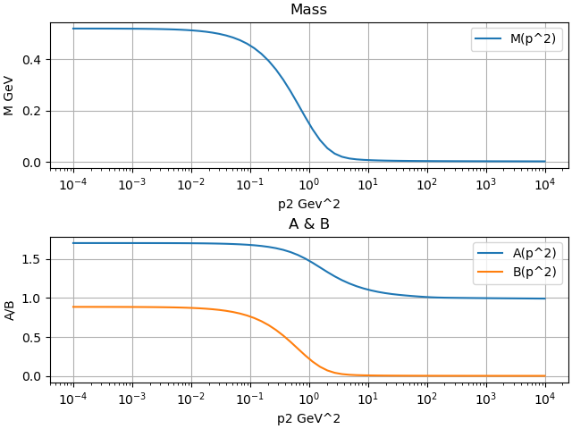
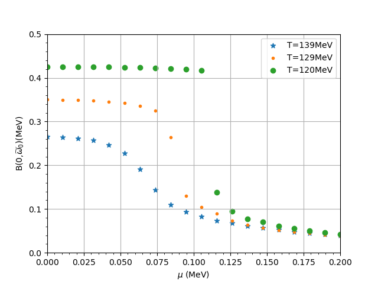

# DSE Solver

## 项目介绍
DSE_Sovler 用于求解零温零化学势以及非零温零化学势下的**Dyson-Schwinger方程**。
该项目利用自洽迭代方法求解DS方程，迭代方案是简单固定点迭代，积分策略是高斯勒让德积分，实现了对QCD问题的非微扰计算。项目中Python和Julia两个版本的程序，均可实现求解。

## 安装依赖
运行python版本所需的依赖：
  - numpy
  - namba
  - scipy
  - matplotlib
  
## 目录结构
+ src/ 源代码
+ test/python/examples  例子
+ test/python/test      功能测试

## DSE_AB
求解零温零化学势下的DSE方程。



程序中求解所使用的胶子模型是Qin-chang model,采用的截断方案是彩虹-梯近似。在此条件下，由文献可知夸克传播子的DS方程。
由此可得夸克传播子的矢量部分$`A(p^2)`$和标量部分$`B(p^2)`$的表达式，二者组成一个非线性积分方程组，可以通过数值迭代的方法求解。
同时为了使计算结果不发散，我们需要引入重整化(renormalization),通过重整化吸收发散，并使的计算结果符合物理。

在做具体的计算之前，我们还需要对方程进行简化，对四维积分进行降维。我们将动量积分转换到欧几里得空间并进行球坐标变换，最终将原积分转化为对内动量$`q^2`$和$`\cos{\theta}`$的简单积分。对于角度积分和动量积分，我们使用高斯勒让德积分（gaussian-legendere）来处理，同时由于动量平方$`p^2`$的范围为$`10^{-4},10^4`$，范围过大，所以对于动量平方的积分使用对数网络。

大致的计算思路如下：
```
初始化A=1, B=0.3
    ↓
进入迭代循环：
    ↓
调用 intreAB(361d0, fArn, fBrn) → 计算重整化点积分值
    ↓
对每个动量点p：
   调用 intreAB(p, reA(p), reB(p)) → 计算新A(p), B(p)
    ↓
更新所有A和B
    ↓
检查收敛 → 若收敛则退出，否则继续迭代
```


## DSE_ABC
求解非零温零化学势下的DSE方程。


对于此处的非零温零化学势下的DSE方程，我只考虑了化学势，忽略了有限轴化学势。对比零温零化学势下的DSE,非零温零化学势下的DSE方程更加复杂。由于$`\mu > 0`$,导致了Matsubara频率$`\omega_n`$的引入，夸克传播子的逆由$`S(p)^{-1}`$变为了$`S(p_k)^{-1}`$，其中$`p_k = (\overrightarrow{p},\widetilde{\omega}_k)`$,$`\widetilde{\omega}_k = \omega_k + i\mu`$.同时当$`\mu\ne0`$时，Matsubara频率变成了一个复数，对复数的处理需要尤其小心！其余的积分思路以及迭代方法与零温零化学势下的基本一致。


## 参考文献
[1] XU S S, CUI Z F, WANG B, 等. The chiral phase transition with a chiral chemical potential in the framework of Dyson-Schwinger equations[J/OL]. Physical Review D, 2015, 91(5): 056003. DOI:10.1103/PhysRevD.91.056003.

[2]徐书生.强子性质与手征相变的非微扰QCD研究[D].南京大学,2015. 

[3]王昆仑. QCD相变和相的性质的Dyson-Schwinger方程方法研究[D]. 北京:北京大学,2013.